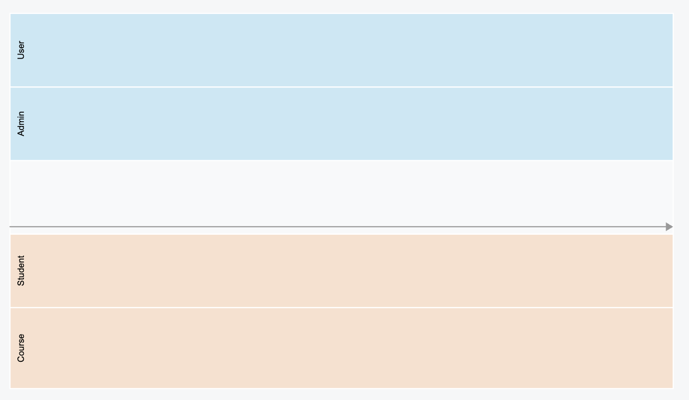
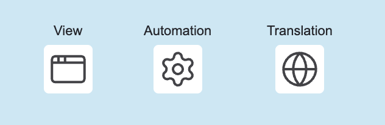
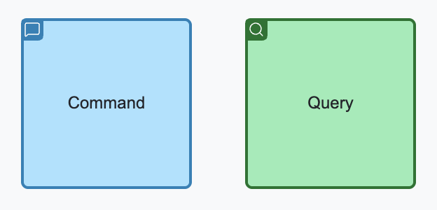
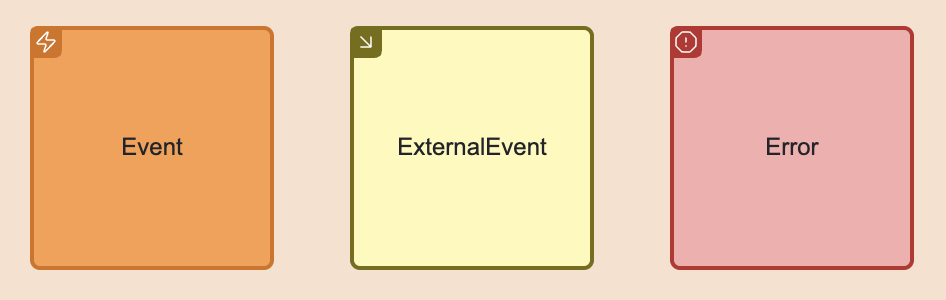
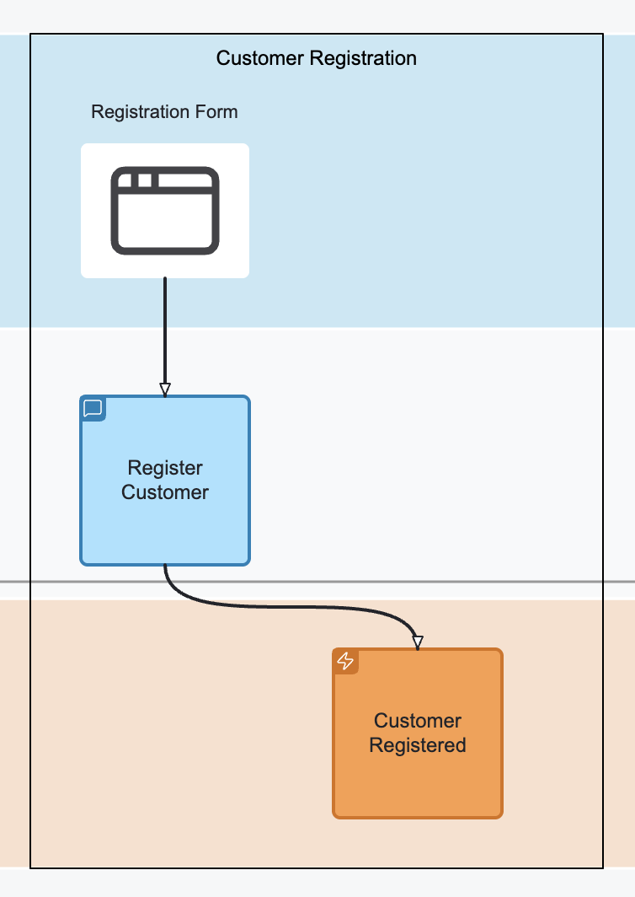
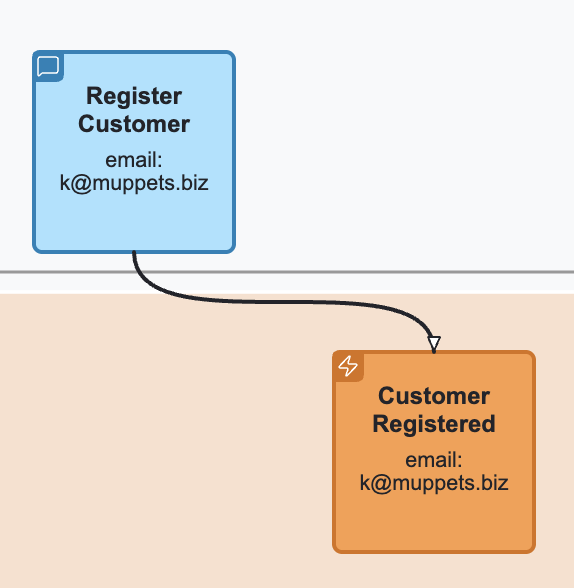
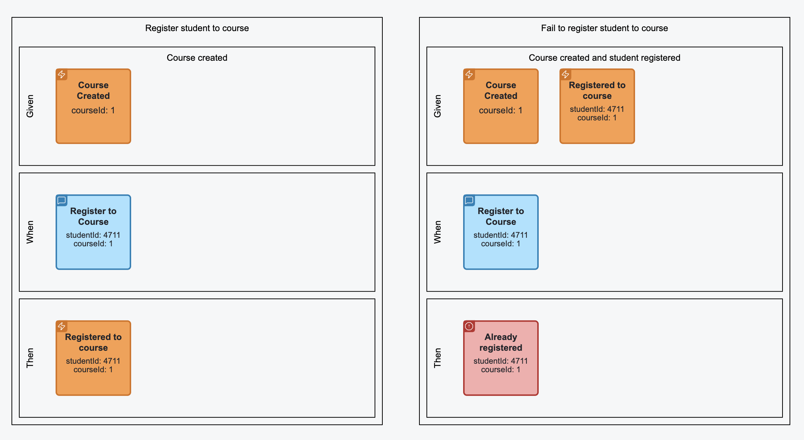
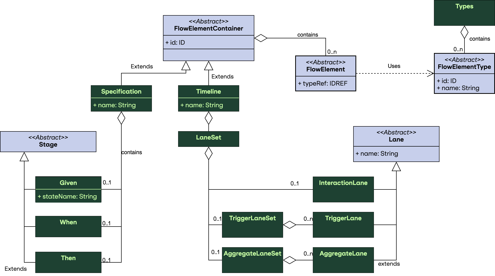
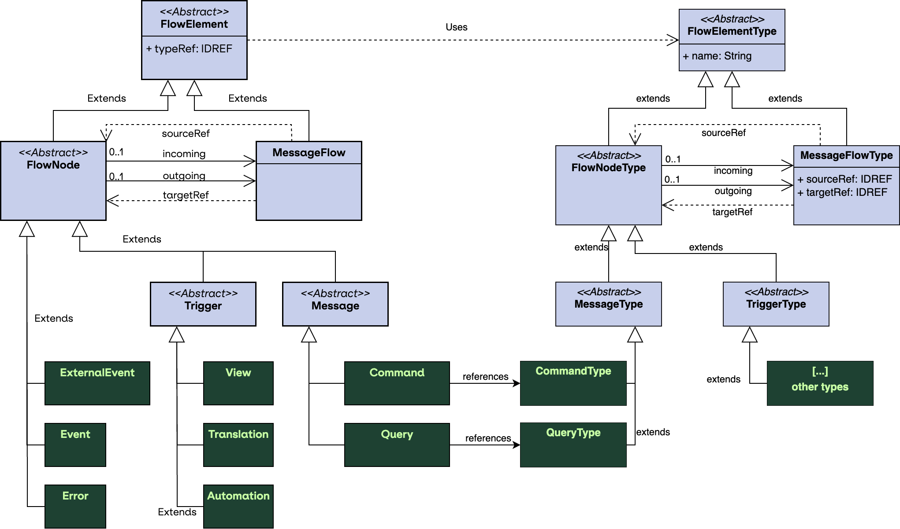

## Overview

### General

Event modeling a popular collaborative method for requirement engineering and solution development of event-driven systems. Developed by Adam Dymitruk in 2018,
it describes an iterative format of modeling and enrichment of a visual diagram, to refine system behaviour. More details on Event modeling is available at
[https://eventmodeling.org](https://eventmodeling.org).

The main diagram of Event Modeling is a timeline, showing the flow of different messages through the system and ordering them into a casual and temporal flow.
Event modeling focus on the method description (the seven steps) but does not provide any formal details for the semantic meaning and exact syntax of the used
elements.

**Event modeling notation** or **EMN** for short introduces a language specification for Event Modeling. This specification aims to fill this gap and provide
both: the exact specification of the elements including their semantics and visualisation and a syntax for storage of the required information.

### EMN Modeling Elements

The EMN Elements are separated into several groups.

The dynamic elements are:

* Triggers
* Interaction messages
* Events
* Flows

The static / grouping elements are:

* Timelines
* Slices
* Lanes
* Groups / Annotations
* Specifications

### EMN Triggers

Triggers are used to denote the sources for the **intent of change**. Currently, the following triggers are supported:

* **View**: represents a UI which can be used by the user to interact with the system and trigger a change
* **External System**: represents a system, causing a change by invoking an API (directly)
* **Automation**: part of the system implementing a policy expressing a transition from internal state change to an action (e.g. Saga Pattern, Workflow)
* **Translation**: part of the system implementing a mapping from internal to external event (aka. Anti Corruption Layer)

Triggers can be placed in one or multiple **trigger lanes** in order to express their responsibility, grouping etc...

### EMN Interaction Messages

EMN is primarily designed for design of CQRS systems (but stil can be applied to other system architectures, if desired), end foster clear segregation
of commands and queries. These two message types are modelled explicitly:

* **Command**: represents an intent for system state change / modification
* **Query**: represents a request/response for data retrieval

### EMN Events and Errors

**Events** are messages produced by system components representing state changes. They can be used for Event Sourcing (if used in CQRS/ES architecture)
or just be handled for event-based state transfer. The latter case can be implemented using **External Events**, originated by an external system.

**Errors** are specific form of events denoting the fact that the intended state change was rejected.

### EMN Message flow

A message flow denotes a connection between two dynamic elements of EMN, meaning "causes". For example, a command dispatching causes a state change which is
causing emitting of an event. In this case, a command is connected to an event.

### EMN Timeline

A **timeline** is a visual representation of a particular journey consisting of triggers, messages and events connected together. A timeline has a temporal
direction
(time goes from left to right, all message flows should point from the past to the future). It might be separated into **lanes**, depending on the completeness
and
progress of the event modeling.

### EMN Lane

There are three types of lanes:

**Trigger lane**: a lane reserved for triggers. Multiple trigger lanes can be used to distinguish the role of the actor, using the trigger.
**Interaction lane**: used to place interaction command: **commands** and **queries**.
**Concept / Aggregate Lane**: a lane holding the **event** messages, denoting the responsibility of command handling and state change.

### EMN Slice

A **slice** is a user-made grouping of elements for different purposes. A slice can be named and represent a unit of implementation or a bounded piece
of behaviour.

### EMN Specification

A **specification** is a behaviour specification by example (often written in `Given`/`When`/`Then` form) including references to messages from the timeline or
slice, enriched with example values and specifying expected behaviour of the system.

### EMN Group / Annotation

Allows to group any amount of elements and attach comments to the groups or individual elements.

## Visualisation

### Timeline with lanes

{align=left}

### Triggers

{align=left, width=50%}

### Interaction messages

{align=left, width=26%}

### Events and Errors

{align=left, width=40%}

### Slices

{align=left, width=35%}

### Message flow and Messages with values

{align=left, width=27%}

### Specification



## Containment rules

1. Trigger elements (View, Automation, Translation, External System) can only be placed into trigger lanes.
2. Commands can only either be placed into interaction lane or into when stage of the specification.
3. Queries can only be placed into interaction lane.
4. Events and events can only either be placed into concept / aggregate lane or in given and then stages of the specification.

## Connection rules

1. A trigger can only be connected with a command
2. A command can be connected to an event or an error
3. An event can be connected to automation, translation or query
4. An external event can be connected to translation only
5. A query can be connected to a view or external system
6. An automation can be connected to a command
7. A translation can be connected to a command, an event or an external event

## EMN Document

An EMN document is an XML document compliant to EMN XML Schema. This section describes the structure of the document and its elements.
In general, the document is separated into several sections: models (types, timelines, specifications) and diagrams.

### Definitions

#### Purpose

The definitions element is the root container of an EMN model file.
It organizes and holds together all key parts of the model, similar to how BPMN or DMN use definitions.

#### Role

* Serves as the entry point for an EMN document.
* Aggregates types, timelines, categories, and specifications.
* Enables modular extension and reuse across tools and teams.

#### Semantics

- Think of definitions as the EMN file boundary.
- All elements inside definitions share the same namespace, context, and model lifecycle.
- Supports interchange between tools, including visualization and code generation.

#### Structure

```xml

<definitions id="myModel" name="Order System Model"
             xmlns="https://holixon.io/spec/EMN/20241231/MODEL"
             xmlns:xsi="http://www.w3.org/2001/XMLSchema-instance"
             xsi:schemaLocation="https://holixon.io/spec/EMN/20241231/MODEL emn.xsd">

  <types>...</types>
  <timeline>...</timeline>
  <category>...</category>
  <specification>...</specification>

</definitions>
```

##### Key Attributes

| Attribute | Description                     |
|-----------|---------------------------------|
| `id`      | Unique identifier of the model. |
| `name`    | Human-readable name (optional). |

##### Contained Elements

The following elements can be placed inside the `Definitions` element:

{align=left}

| Element         | Purpose                                                    |
|-----------------|------------------------------------------------------------|
| `types`         | Defines reusable flow element types.                       |
| `timeline`      | Describes the event flow over time (optional, multiple).   |
| `category`      | Organizes elements into meaningful categories.             |
| `specification` | Describes a Given-When-Then scenario (optional, multiple). |

### Types

#### Purpose

The Types Section in EMN defines the reusable element types that describe the possible building blocks of a system model.
These types act as templates for commands, events, queries, views, and other flow elements.
By separating types from instances, EMN enables reuse, consistency, and clear semantics across multiple timelines, slices, or scenarios.

#### Semantics

#### Structure

```xml 

<types>
  <!-- Contains type definitions -->
</types>
```

##### Contained Elements

| Element           | Description                                      |
|-------------------|--------------------------------------------------|
| `flowElementType` | Defines a reusable flow element type (abstract). |

Each `flowElementType` describes a template that can be instantiated as `flowElement` in timelines or slices.

##### Attributes of `flowElementType`

| Attribute     | Type         | Description                            |
|---------------|--------------|----------------------------------------|
| `id`          | `xsd:ID`     | Unique identifier of the type.         |
| `name`        | `xsd:string` | Human-readable name.                   |
| `categoryRef` | `xsd:QName`  | Optional categorization for filtering. |

##### Type Hierarchy of `flowElementType`

`flowElementType` is an abstract base type. Specific subtypes include `flowNodeType` and `messageFlowType`.
The `flowNodeType` is an abstract type to represent the structural types (nodes). The `messageFlowType`
represents dependencies between the nodes (edges).

The following diagram expresses those relations:

{align=left}

##### Attributes of `flowNodeType`

| Attribute  | Type         | Description                                                        |
|------------|--------------|--------------------------------------------------------------------|
| `incoming` | `xsd:QName`  | Array of incoming connections (`messageFlowType`), might be empty. |
| `outgoing` | `xsd:QName`  | Array of outgoing connections (`messageFlowType`), might be empty. |
| `schema`   | `emn:Schema` | Optional schema element.                                           |

As you see above one node may have multiple incoming and multiple outgoing message flow types attached to it.

##### Attributes of `messageFlowType`

| Attribute   | Type        | Description                             |
|-------------|-------------|-----------------------------------------|
| `sourceRef` | `xsd:IDREF` | ID of the source type (`flowNodeType`). |
| `targetRef` | `xsd:IDREF` | ID of the target type (`flowNodeType`). |

##### Concrete `flowNodeType`

| Subtype              | Purpose                                         |
|----------------------|-------------------------------------------------|
| `automationType`     | Describes automated system reactions.           |
| `commandType`        | Describes commands that trigger changes.        |
| `errorType`          | Describes errors or exceptions.                 |
| `eventType`          | Describes domain events.                        |
| `externalSystemType` | Represents external system interactions.        |
| `externalEventType`  | Represents events from outside the system.      |
| `queryType`          | Describes query results / projections.          |
| `translationType`    | Describes message translation or mapping logic. |
| `viewType`           | Describes a view to originate command from.     |

#### Example

```xml

<types xmlns="https://holixon.io/spec/EMN/20241231/MODEL">
  <viewType id="view24">
    <outgoing>v2c_createCustomer</outgoing>
  </viewType>
  <commandType id="createCustomer">
    <incoming>v2c_createCustomer_1</incoming>
    <outgoing>c2e_createCustomer_1</outgoing>
  </commandType>
  <eventType id="customerCreated">
    <incoming>c2e_createCustomer_1</incoming>
  </eventType>
  <messageFlowType id="v2c_createCustomer"
                   sourceRef="view24" targetRef="createCustomer"/>
  <messageFlowType id="c2e_createCustomer"
                   sourceRef="createCustomer" targetRef="customerCreated"/>
</types>

```

#### Schemas and Payload Definitions

Each `flowElementType` may optionally reference a schema describing the message or event structure.

| Attribute      | Type         | Description                                                                                   |
|----------------|--------------|-----------------------------------------------------------------------------------------------|
| `schemaFormat` | `xsd:string` | MIME type (e.g., application/schema+json)                                                     |
| `resource`     | `xsd:string` | Optional path or URL to the schema. If omitted, the `schema` must contain definition as body. |

Example of external schema:

```xml

<commandType id="CreateOrderCommand" name="Create Order">
  <schema resource="schemas/CreateOrder.json" schemaFormat="application/schema+json"/>
</commandType>
```

Example of embedded schema:

```xml

<commandType id="CreateOrderCommand" name="Create Order">
  <schema schemaFormat="application/schema+json">
    <![CDATA[
    {
      "type": "object",
      "properties": {
        "orderId": { "type": "string" },
        "customerId": { "type": "string" },
        "items": {
          "type": "array",
          "items": {
            "type": "object",
            "properties": {
              "sku": { "type": "string" },
              "quantity": { "type": "integer" }
            },
            "required": ["sku", "quantity"]
          }
        }
      },
      "required": ["orderId", "customerId", "items"]
    }
  ]]>
  </schema>
</commandType>
```

### Timeline

#### Purpose

The **Timeline Section** defines the **temporal order** of events, commands, queries, and other flow elements.  
It represents the **system narrative** as a sequence of actions and outcomes, forming the backbone of event modeling.

#### Semantics

The timeline defines the chronological sequence of flow elements.

- Elements placed on the timeline express when things occur relative to each other (total or partial order).
- The timeline is the canonical temporal model; other constructs (e.g., slices) are semantic projections over it.
- Temporal ordering captures observable system evolution (what happened and in which order), distinct from ownership or responsibility.
- Tools may use timeline positions for layout, simulation, and validation (e.g., ensure no temporal contradictions).

#### Structure

```xml

<timeline>
  <!-- Contains flow elements, lane sets and slice sets -->
</timeline>
```

##### Attributes of `timeline`

| Attribute | Type         | Description                        |
|-----------|--------------|------------------------------------|
| `id`      | `xsd:ID`     | Unique identifier of the timeline. |
| `name`    | `xsd:string` | Name of the timeline.              |

##### Contained Elements

| Element       | Description                                                        |
|---------------|--------------------------------------------------------------------|
| `flowElement` | Instances of `flowElementType`, positioned in sequence (abstract). |
| `laneSet`     | An optional `laneSet`, to define different lanes.                  |
| `sliceSet`    | An optional `sliceSet`, to define different slices.                |

##### Attributes of `flowElement`

| Attribute | Type        | Description                           |
|-----------|-------------|---------------------------------------|
| `id`      | `xsd:ID`    | Unique identifier of the element.     |
| `typeRef` | `xsd:IDREF` | Reference to the type of the element. |

##### Contained elements of `flowElement`

| Element            | Description                              |
|--------------------|------------------------------------------|
| `categoryValueRef` | Optional sequence of category values.    |
| `value`            | Optional value specifying this instance. |

##### Type Hierarchy of `flowElement`

`flowElement` is an abstract element. Specific subtypes include `flowNode` and `messageFlow`.
The `flowNode` is an abstract element to represent the structural elements (nodes). The `messageFlow`
represents dependencies between the nodes (edges).

##### Attributes of `flowNode`

| Attribute  | Type        | Description                                                    |
|------------|-------------|----------------------------------------------------------------|
| `incoming` | `xsd:QName` | Array of incoming connections (`messageFlow`), might be empty. |
| `outgoing` | `xsd:QName` | Array of outgoing connections (`messageFlow`), might be empty. |

As you see above one node may have multiple incoming and multiple outgoing message flows attached to it.

##### Attributes of `messageFlow`

| Attribute   | Type        | Description                    |
|-------------|-------------|--------------------------------|
| `sourceRef` | `xsd:IDREF` | ID of the source (`flowNode`). |
| `targetRef` | `xsd:IDREF` | ID of the target (`flowNode`). |

##### Concrete `flowNode`

| Subtype          | Purpose                                         |
|------------------|-------------------------------------------------|
| `automation`     | Describes automated system reactions.           |
| `command`        | Describes commands that trigger changes.        |
| `error`          | Describes errors or exceptions.                 |
| `event`          | Describes domain events.                        |
| `externalSystem` | Represents external system interactions.        |
| `externalEvent`  | Represents events from outside the system.      |
| `query`          | Describes query results / projections.          |
| `translation`    | Describes message translation or mapping logic. |
| `view`           | Describes a view to originate command from.     |

#### Value Definition

The value of elements is used to express their specific meaning in the timeline. For example, you might want to express the fact, that
a particular value of the message is passed to another message or express that a repetitive usage of the value leads to a certain condition.
The values can be specified by as embedded value (as part of the body) or using external resource referenced in the `resource` attribute.
The value is expressed in a value format which can be set in the `valueFormat` attribute, defaulting to `application/json`.

| Attribute     | Type         | Description                                                                                  |
|---------------|--------------|----------------------------------------------------------------------------------------------|
| `valueFormat` | `xsd:string` | MIME type (e.g., application/json as default)                                                |
| `resource`    | `xsd:string` | Optional path or URL to the schema. If omitted, the `value` must contain definition as body. |

Example of external value definition:

```xml

<command id="createCustomer_4711" typeRef="createCustomer">
  <value resource="values/create_customer_4711.json"/>
</command>
```

Example of embedded value definition:

```xml

<command id="createCustomer_4711" typeRef="createCustomer">
  <value>
    <![CDATA[
      {
        "customerId": 4711,
        "customerName": "Kermit, The Frog"
      }    
    ]]>
  </value>
</command>
```

#### Example

```xml

<timeline xmlns="https://holixon.io/spec/EMN/20241231/MODEL">
  <view id="view24_1" typeRef="view24">
    <outgoing>v2c_createCustomer_1</outgoing>
  </view>
  <command id="createCustomer_1" typeRef="createCustomer">
    <value>
      <![CDATA[
      {
        "customerId": 4711,
        "customerName": "Kermit, The Frog"
      }
      ]]>
    </value>
    <incoming>v2c_createCustomer_1</incoming>
    <outgoing>c2e_createCustomer_1</outgoing>
  </command>
  <event id="customerCreated_1" typeRef="customerCreated">
    <value>
      <![CDATA[
      {
        "customerId": 4711,
        "customerName": "Kermit, The Frog"
      }
      ]]>
    </value>
    <incoming>c2e_createCustomer_1</incoming>
  </event>
  <messageFlow id="v2c_createCustomer_1" typeRef="v2c_createCustomer"
               sourceRef="view24_1" targetRef="createCustomer_1"/>
  <messageFlow id="c2e_createCustomer_1" typeRef="c2e_createCustomer"
               sourceRef="createCustomer_1" targetRef="customerCreated_1"/>
</timeline>

```

### Lanes

Lanes in EMN represent horizontal partitions of the timeline that group related modeling elements.  
They provide structure to the diagram by separating concerns such as triggers, interactions, and concepts/aggregates.

#### Types of Lanes

- **Trigger Lane**  
  Used to represent triggers that initiate parts of the flow, such as external events or user actions.

- **Interaction Lane**  
  Contains interactions like commands and queries that describe the communication between users, systems, or aggregates.

- **Aggregate Lane**  
  Formerly called *concept lane*, it holds conceptual groupings like aggregates, entities, or other domain concepts that produce or consume events.

#### Purpose

- Organize the timeline into meaningful partitions.
- Distinguish between **triggers**, **interactions**, and **aggregates (concepts)**.
- Improve visual clarity by grouping related elements into lanes.

#### Semantics

- **Trigger Lanes**: Represent external inputs or user/system actions that initiate flows. If an element is placed into this lane,
  it takes the role of the lane. Useful trigger lanes represent any kind of grouping (e.G user/admin/customer for views).
- **Interaction Lane**: Captures the flow of interactions, e.g., commands and queries.
- **Aggregate Lanes**: Represent aggregates or domain concepts. Placement of events in different aggregate lanes means assign
  them to different aggregates and define their responsibilities.
- Lanes do not change the semantics of the contained elements but serve as a structural and visual organization mechanism.

#### Structure

```xml

<laneSet>
  <triggerLaneSet>...</triggerLaneSet>
  <interactionLane>...</interactionLane>
  <aggregateLaneSet>...</aggregateLaneSet>
</laneSet>
``` 

##### Contained elements

| Element            | Description                                                                                      |
|--------------------|--------------------------------------------------------------------------------------------------|
| `triggerLaneSet`   | A lane set for trigger lanes. Every `triggerLane` may express a trigger role.                    |
| `interactionLane`  | A lane for `command` and `query` interactions.                                                   |
| `aggregateLaneSet` | A lane for for aggregate lanes. Every `aggregateLane` may express a different concept/aggregate. |

##### Attributes of `Lane`

Lane represents an abstract concept and has three concrete sub types: `TriggerLane`, `InteractionLane` and `AggregateLane`.

| Attribute     | Type         | Description                                                         |
|---------------|--------------|---------------------------------------------------------------------|
| `id`          | `xsd:ID`     | Lane id.                                                            |
| `name`        | `xsd:string` | Name of the lane. Especially useful on trigger and aggregate lanes. |
| `flowNodeRef` | `xsd:IDREF`  | Specifies the IDs of `flowElement`s included into this lane.        |

#### Aggregate Type Definition

For aggregates, it is possible to define the type of its identity, by specifying the `idSchema`. `idSchema` is a `schema` for the identity
and can be specified similar to schema of the structural message:

Example of external schema:

```xml

<aggregateLane id="customer" name="Customer">
  <idSchema resource="schemas/CustomerId.json" schemaFormat="application/schema+json"/>
</aggregateLane>
```

Example of embedded schema:

```xml

<aggregateLane id="customer" name="Customer">
  <schema schemaFormat="application/schema+json">
    <![CDATA[
    {
      "type": "object",
      "properties": {
        "customerId": { "type": "string" },
      },
      "required": ["customerId"]
    }
  ]]>
  </schema>
</aggregateLane>
```

#### Example

```xml

<laneSet>
  <triggerLaneSet>
    <triggerLane id="triggers_1" name="User Actions">
      <flowNodeRef>View24</flowNodeRef>
    </triggerLane>
    <triggerLane id="triggers_2" name="Admin Actions">
      <flowNodeRef>View25</flowNodeRef>
    </triggerLane>
  </triggerLaneSet>
  <interactionLane id="interactions_1">
    <flowNodeRef>CreateOrderCommand</flowNodeRef>
    <flowNodeRef>CheckInventoryQuery</flowNodeRef>
  </interactionLane>
  <aggregateLaneSet>
    <aggregateLane id="order" name="Order">
      <flowNodeRef>OrderCreatedEvent</flowNodeRef>
      <flowNodeRef>OrderConfirmedEvent</flowNodeRef>
    </aggregateLane>
    <aggregateLane id="inventory" name="Inventory">
      <flowNodeRef>OrderCreatedEvent</flowNodeRef>
      <flowNodeRef>OrderConfirmedEvent</flowNodeRef>
    </aggregateLane>
  </aggregateLaneSet>
</laneSet>
```

### Slices

Slices in EMN define vertical groupings of flow elements across the timeline.  
They are used to capture a meaningful unit of progression, often representing a single user interaction, business transaction, or system step.

#### Purpose

- Organize flow elements into **coherent vertical cuts** across lanes.
- Represent a **stage or increment** in the modeled process.
- Provide a way to **analyze and discuss** the system step by step.

#### Structure

The root container for slices is the **sliceSet**.  
It can contain multiple **slice** elements.

```xml 

<sliceSet>
  <slice>...</slice>
  <slice>...</slice>
</sliceSet>
```

Each slice contains references to flow nodes that belong to this vertical grouping.

#### Semantics

- A **slice** represents a logical step or milestone across the timeline.
- It connects related events, commands, and aggregates that occur together in a business scenario.
- Slices are **orthogonal to lanes**: lanes group horizontally by role or concept, slices group vertically by temporal or logical progression.
- Slices provide a mechanism for **narrating the model** step by step.

#### Attributes of `slice`

| Attribute   | Type       | Use                  | Description                                     |
|-------------|------------|----------------------|-------------------------------------------------|
| name        | xsd:string | optional             | Descriptive label for the slice                 |
| flowNodeRef | xsd:IDREF  | optional, repeatable | References to flow nodes included in this slice |

#### Example

```xml

<sliceSet name="Order Flow Slices">
  <slice id="Slice1" name="Order Creation">
    <flowNodeRef>StartOrderEvent</flowNodeRef>
    <flowNodeRef>CreateOrderCommand</flowNodeRef>
    <flowNodeRef>OrderCreatedEvent</flowNodeRef>
  </slice>
  <slice id="Slice2" name="Order Confirmation">
    <flowNodeRef>ConfirmOrderCommand</flowNodeRef>
    <flowNodeRef>OrderConfirmedEvent</flowNodeRef>
  </slice>
</sliceSet>
```

### Specifications

The **Specification** section in EMN provides a way to capture behavior in a structured form, inspired by *Given-When-Then* notation.  
It connects the structural modeling elements (events, commands) with executable specifications that describe expected outcomes.

#### Purpose

- Define **scenarios** that describe system behavior in concrete terms.
- Provide a **narrative layer** on top of the timeline, slices, and lanes.
- Support **testable definitions** of domain logic using a familiar pattern.

#### Structure

The `specification` is a named container holding a textual narrative and three `stage`s of a scenario or use case. The `stage` is
an abstract type with three subtypes: `given`, `when` and `then`. The stages differ semantically, but have the same structure.

```xml

<specification>
  <given>...</given>
  <when>...</when>
  <then>...</then>
</specification>
```

#### Semantics

- **given** sets the context by listing the flow elements that define the starting state. For an event-sourced system this is a series of events.
- **when** defines the action that triggers the scenario (e.g., a command or query).
- **then** defines the expected events or state changes that must result.
- Specifications may be linked to **slices** to connect behavior with process steps.

#### Attributes of `specification`

| Attribute | Type       | Use      | Description                                          |
|-----------|------------|----------|------------------------------------------------------|
| name      | xsd:string | required | Unique name of the specification                     |
| scenario  | xsd:string | optional | Human-readable description of the scenario           |
| sliceRef  | xsd:IDREF  | optional | Reference to the slice this specification belongs to |

#### Attributes of `given` stage

The Given Stage may provide a name of the state it describes by its contained elements.

| Attribute | Type       | Use      | Description                                          |
|-----------|------------|----------|------------------------------------------------------|
| stateName | xsd:string | optional | Name of the state being assumed in the `given` stage |

#### Contained Elements of `stage`

| Contained Element | Cardinality | Description                         |
|-------------------|-------------|-------------------------------------|
| flowElement       | 0..n        | Flow elements included in the stage |

#### Example

```xml

<specification xmlns="https://holixon.io/spec/EMN/20241231/MODEL"
               name="Don't create customer if already exists"
               scenario="If the customer with the same customer id already created, the creation command should be rejected.">
  <given stateName="Customer Exists">
    <event typeRef="customer_created">
      <value>
        <![CDATA[
        {
          "customerId": 4711,
          "customerName": "Kermit, The Frog"
        }
        ]]>
      </value>
    </event>
  </given>
  <when>
    <command typeRef="create_customer">
      <value>
        <![CDATA[
        {
          "customerId": 4711,
          "customerName": "Kermit, The Frog"
        }
        ]]>
      </value>
    </command>
  </when>
  <then>
    <error typeRef="duplicate_customer">
      <value>
        <![CDATA[
        {
            "message": "Customer with id 4711 already exists"
        }
        ]]>
      </value>
    </error>
  </then>
</specification>
```
