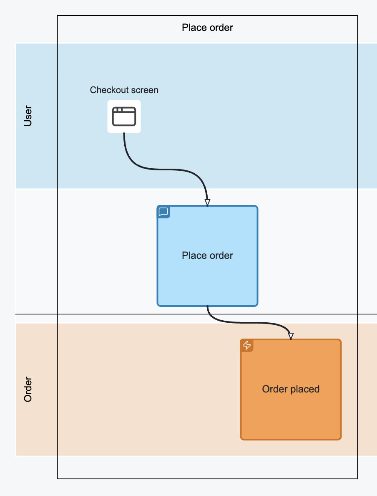
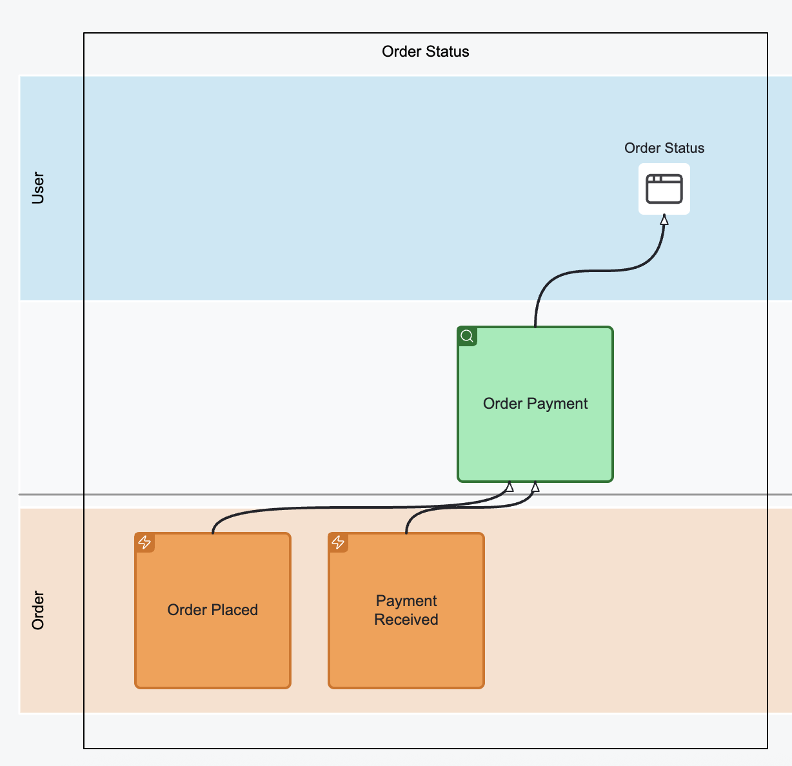
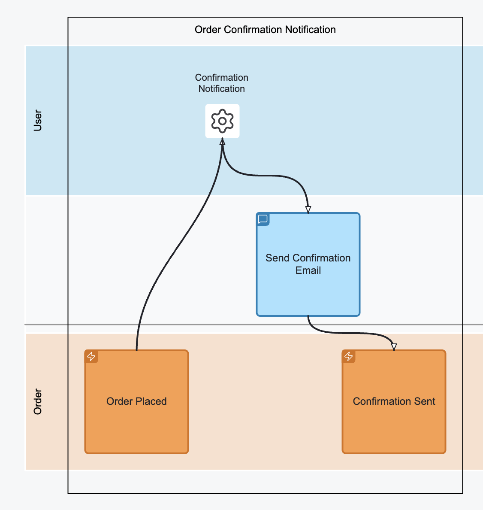
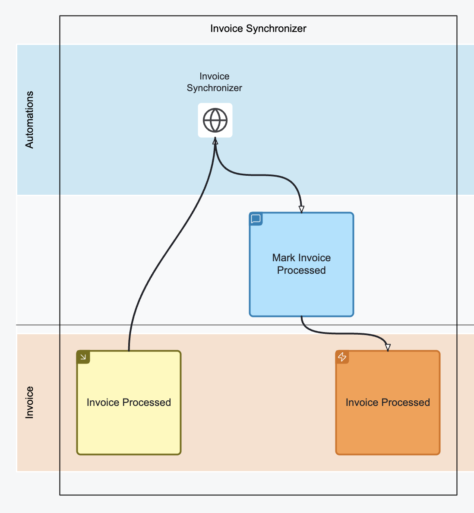

To model a meaningful and implementable EMN diagram, it's important to understand and apply 
**four core patterns**. Each pattern represents a common structure for how information flows 
through the system and can be visualized as a **slice** — a self-contained unit of work that 
captures everything a developer needs to implement a feature.

## State-change by command

**Trigger → Command → Event(s)**

{ align=left, width=30% }

This pattern represents a user- or system-initiated change in state. It begins with a **Trigger**, which leads to a **Command**, 
and results in one or more **Events**.

- Use this to describe how business actions begin and what state changes they cause.
- Start with naming the boxes meaningfully, then refine them with relevant parameters.
- Example: *User clicks “Place Order” on a “Checkout screen” → “Place Order” Command → “Order Placed” Event*

## View Pattern

**Event(s) → Query → View**

{ align=left, width=50% }

This pattern defines how system state is **read**. A **View** derives its data from one or more **Events** using a **Query**.

- Use this to show what information the system makes available for display or decision-making.
- A View can only use already existing events — missing data will become obvious quickly.
- Example: *“Order Placed” + “Payment Received” Events → “Order Payment” Query → “Order Status” View*

## Automation Pattern

**Event(s) → Automated Trigger → Command → Event(s)**

{ align=left, width=40% }

This pattern models **automated workflows** where the system observes data and reacts without user intervention.

- Treat the **Automated Trigger** like a robot reading a **todo list**.
- When a condition is met, it issues a **Command**, resulting in new **Events**.
- There is **no business logic** in the automation — only observation and action.
- Example: *“Order Placed” Event → “Confirmation Notification” → “Send Confirmation Email” Command → “Confirmation Sent” Event*

## Translation Pattern

**Event(s) (source system) → Automated Trigger → Command → Event(s) (target system)**

{ align=left, width=40% }

Use this when transferring knowledge or state between **different systems**.

- The structure is the same as the Automation Pattern.
- The **read side** must be limited to a single source system.
- The **write side** can publish to multiple systems using mechanisms like Pub/Sub.
- Example: *“Invoice Processed” Event from System A → Invoice Synchronizer → “Mark Invoice Processed” Command → “Invoice Processed” Event in System B*
