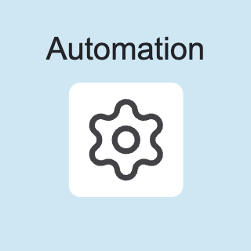
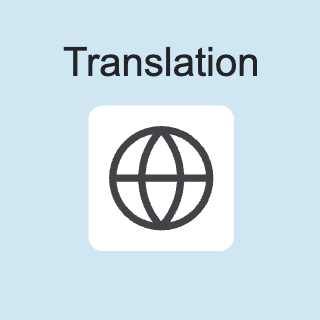
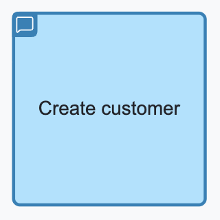
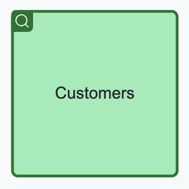
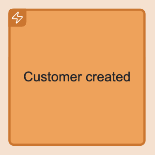
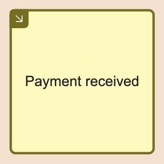
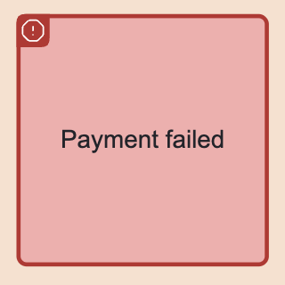

## Basics

### Triggers

Triggers are used to denote the sources for the **intent of change**. Currently, the following triggers are supported:

* [**View**](#view)
* [**External System**](#external-system)
* [**Automation**](#automation) 
* [**Translation**](#translation)

Triggers can be placed in one or multiple **trigger lanes** in order to express their responsibility, grouping etc.

#### View

{width=160}

A view represents a UI which can be used by the user to interact with the system and trigger a change.

#### External System

{width=160}

An external system represents a system, causing a change by invoking an API (directly).

#### Automation

{width=160}

An automation is a part of the system implementing a policy expressing a transition from internal 
state change to an action (e.g. Saga Pattern, Workflow)

#### Translation

{width=160}

A translation is part of the system implementing a mapping from internal to external event (aka. Anti Corruption Layer).

### Interaction Messages

Event Modeling is primarily designed for design of CQRS systems (but stil can be applied to other system architectures, if desired), 
and fosters clear segregation of commands and queries. These two message types are modelled explicitly:

* [**Command**](#command)
* [**Query**](#query) 

#### Command

{width=160}

A command represents an intent for system state change / modification.

#### Query

A query represents a request/response for data retrieval.

{width=160}

### Event, External Event and Error

* [**Event**](#event)
* [**External Event**](#external-event)
* [**Error**](#error)

#### Event

{width=160}

Events are produced by system components representing state changes. They can be used for Event Sourcing (if used in CQRS/ES architecture)
or just be handled for event-based state transfer.

#### External Event

{width=160}

An event-based state transfer from external system can be implemented using **External Event**.

#### Error

{width=160}

An error is a specific type of event, denoting the fact that the intended state change was rejected.

### Information flow

An information flow denotes a connection between two dynamic elements, meaning "causes". For example, a command dispatching causes a state change which is
causing emitting of an event. In this case, a command is connected to an event.

## Timeline

A **timeline** is a visual representation of a particular journey consisting of triggers, messages and events connected together. A timeline has a temporal
direction (time goes from left to right, all message flows should point from the past to the future). It might be separated into **lanes**, depending on the 
completeness and progress of the event modeling.

## Lane

There are three types of lanes:

* [**Trigger Lane**](#trigger-lane)
* [**Interaction Lane**](#interaction-lane)
* [**Concept Lane**](#concept-lane)

#### Trigger Lane

**Trigger lane** is a lane reserved for triggers. Multiple trigger lanes can be used to distinguish the role of the actor, using the trigger.

#### Interaction Lane

**Interaction lane**: used to place interaction command: **commands** and **queries**.

#### Concept Lane

**Concept lane** a lane holding the **event** messages, denoting the responsibility of command handling and state change.

## Slice

A **slice** is a user-made grouping of elements for different purposes. A slice can be named and represent a unit of implementation or a bounded piece
of behaviour.

## Specification

A **specification** is a behaviour specification by example (often written in `Given`/`When`/`Then` form) including references to messages from the timeline or
slice, enriched with example values and specifying expected behaviour of the system.

## Group / Annotation

A group allows to group any amount of elements. Using a text annotation it is possible to attach comments to 
the groups or individual elements.
